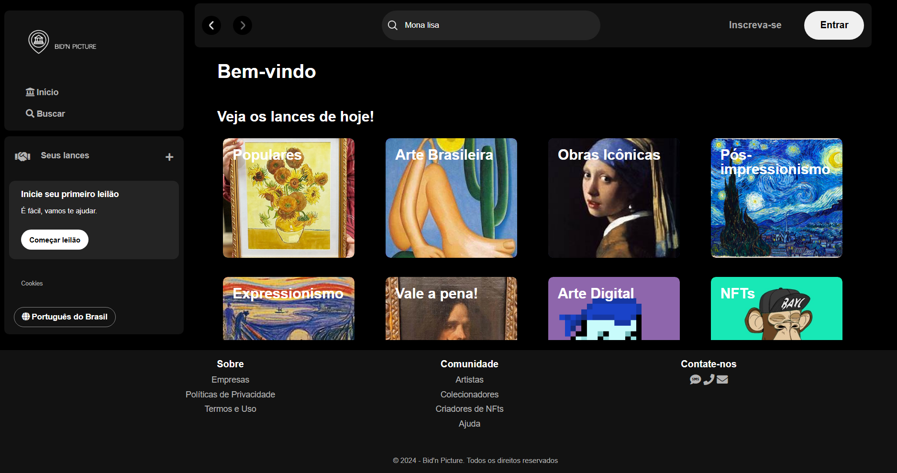

# 🎨 Bid'n Picture - Leilão de Obras de Arte e NFTs

Neste projeto, criei uma interface inspirada no Spotify utilizando **HTML, CSS e JavaScript**. Como diferencial, personalizei a aplicação para exibir um **leilão virtual de obras de arte e NFTs** (ideia criativa que tive no dia 😅), permitindo a busca e exibição de quadros de artistas renomados.

Atualmente, o projeto está em desenvolvimento, com algumas funcionalidades pendentes, como a integração correta da API. Futuramente, pretendo aprimorar o projeto, incluindo a implementação do **React** e ajustes na filtragem de obras.

## 🚀 Funcionalidades

✔️ Interface inspirada no Spotify  
✔️ Exibição de quadros e obras de arte  
✔️ Busca por nome do quadro  
✔️ Estilização responsiva  

⚠️ **Pendências**:  

- Como mencionado, a correção da API para filtrar corretamente as obras pesquisadas  
- Integração com React (futuramente)  

## 🛠️ Como Rodar o Projeto

Vamos a um passo a passo para rodar o projeto em seu computador.

### 📌 1. Clonar o Repositório

```bash
git clone https://github.com/seu-usuario/seu-repositorio.git
cd seu-repositorio
```

Você também pode utilizar o **GitHub Desktop** para clonar o repositório. Caso utilize o **VS Code**, poderá usar extensões que facilite esse processo. (Caso não conheça, é o "**GitHub Repositories**").

### 📌 2. Instalar o JSON Server

Caso ainda não tenha o **JSON Server**, instale com o comando:

```bash
npm install -g json-server
```

### 📌 3. Rodar a API Localmente

Na pasta do projeto, execute:

```bash
json-server --watch src/APIs/quadros.json --port 3000
```

Isso fará com que a API rode em `http://localhost:3000/quadros`.

☝️ Você também pode clicar com o botão direito na pasta onde está o quadros.json no VS Code e selecionar “Abrir no Terminal” para garantir que está no local certo.

### 📌 4. Abrir o Projeto

Basta abrir o arquivo `index.html` no navegador ou rodar com a extensão **Live Server** no VS Code.

## 🖼️ Exemplo de Dados da API (`quadros.json`)

```json
[
    {
        "id": 1,
        "titulo": "Mona Lisa",
        "artista": "Leonardo da Vinci",
        "ano": 1503,
        "urlImg": "https://upload.wikimedia.org/wikipedia/commons/6/6a/Mona_Lisa.jpg"
    },
    {
        "id": 2,
        "titulo": "Noite Estrelada",
        "artista": "Vincent van Gogh",
        "ano": 1889,
        "urlImg": "https://www.moma.org/media/W1siZiIsIjMwMjUwMCJdLFsicCIsImNvbnZlcnQiLCItcmVzaXplIDEwMjR4Il1d.jpg"
    }
]
```

## 🖼️ Parte da Interface do software



## 🎯 Próximos Passos

- [ ] Corrigir a API para exibir apenas o quadro pesquisado  
- [ ] Melhorar a responsividade  
- [ ] Implementar React para maior dinamismo  

## Considerações finais

Esse projeto foi feito durante a ** **Imersão Front-end - 2ª Edição da Alura** e foi uma ótima oportunidade para praticar e aprender novas funcionalidades no mundo da programação, além de tentar praticar minha criatividade.
